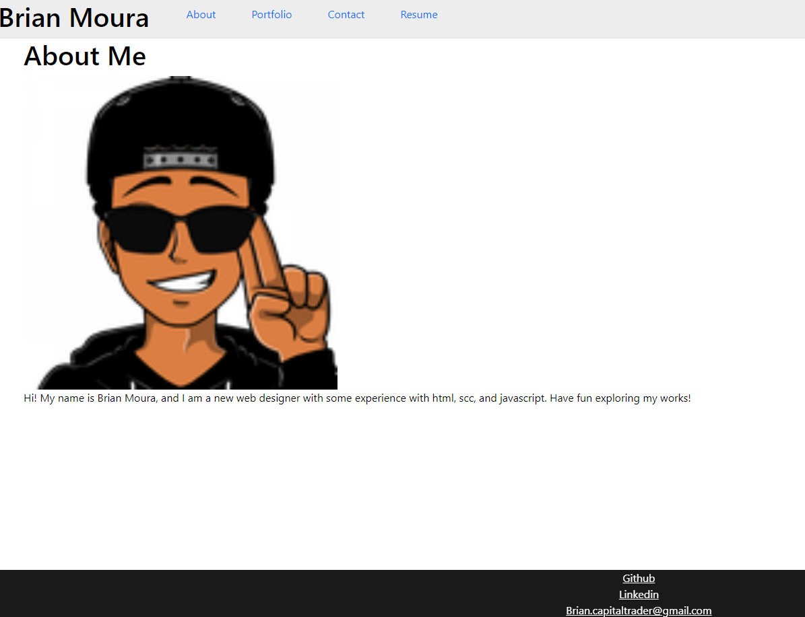

# Bmjr-React-portfolio

## Table of Contents

[Description](#description)

[Useage](#useage)

[Installation](#installation)

[Visuals](#visuals)

[Tests](#tests)

[Contributors](#contributors)

[Links](#links)

[Questions](#questions)

## Description

It is a React based Website that should work as a portfolio

## Useage

To use this project: 
-Install dependencies, npm i
-Start vite, npm run dev.  

## Installation

To install, download as a zip file or git clone in gitbash or other equivelences.

## Visuals

## Tests

 Go to https://main--stellular-begonia-7c1893.netlify.app/ and look around it.  The images do not work for some reason

## Contributing

Brian Moura

## Links

Github Repo:

## Questions

brian.capitaltrader@gmail.com
